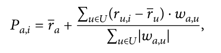

# Recommendation Engines

The purpose of this project was to implement collaborative and non-personalized recommendation methods for a movie ratings dataset in R. 

## Getting Started

This project is divided into two parts:

1. Collaborative Filtering engine 
2. Non-Personalized Engine

I used the dplyr package to perform most of the data operations.

## Method Implementation
### Non-Personalized Engine

In this part, I followed the Non-Personalized filtering approach to: 
1. Get the top 5 movies by rating mean (mean of ratings for all movies)

2. Get the top movies by rating distribution (the % of ratings that are 4 stars or higher for all movies)

3. Top 5 movies by quantity of ratings

4. User similarities in watched movies (people who watched this movie also watched..)

5. User similarities in liked movies (people who liked this movie also liked..)

6. This part was a free non-personalized system implementation using the movieLens dataset (available [here](http://files.grouplens.org/datasets/movielens/ml-10m-README.html))

### Collaborative Filtering
In this part, I followed the Non-Personalized filtering approach to: 
1. Get the pearson colleration between 2 users based on the movies that they both rated

2. Compare the correlations between several users

3. Implement a weighted average method using the method below: 

taken from the Weighted Sum of Others’ Ratings section in the below article: 
[A Survey of Collaborative Filtering Techniques](https://www.hindawi.com/journals/aai/2009/421425/)

You can check the above document for a practical example about how this method works. 

4. Get the top 5 critics that are most similar to one of the users.

